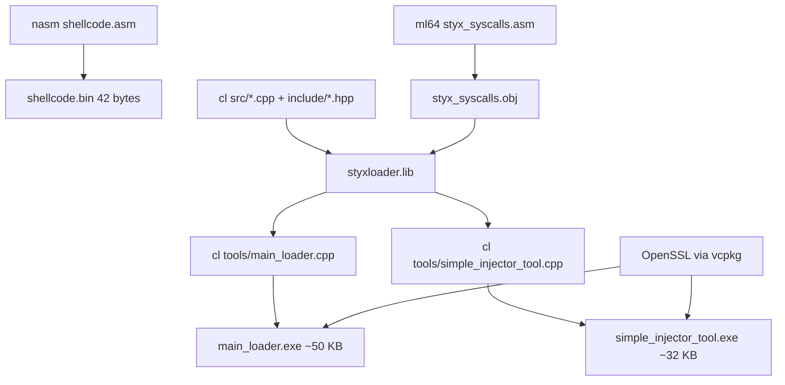

⚠️ ACADEMIC RESEARCH ONLY
This code is published for educational purposes to help defenders
understand evasion techniques. Do not use for malicious purposes.
Author is a defensive security engineer.

# StyxLoaderX: Windows x64 Injection Research Framework

[](LICENSE)
[](https://isocpp.org/)
[](https://www.microsoft.com/en-us/windows)
[](https://github.com/frangelbarrera/StyxLoaderX-Injection-Research)
[](https://github.com/frangelbarrera/StyxLoaderX-Injection-Research/actions/workflows/build.yml)

> **Honesty note (refactor series):** This README previously claimed
> "Advanced EDR Evasion Framework", "85% evasion rate", "Sub-5-second
> payload deployment", "Tested Against Sysmon". Those claims were
> fabricated — see `docs/test_report.md` for the full accounting. The
> framework has been renamed to "Windows x64 Injection Research
> Framework" and the claims have been corrected.

## Overview

**StyxLoaderX** is a modular research framework for studying Windows x64
process injection techniques. It implements three injection modes
(simple `CreateRemoteThread`, direct syscalls, process hollowing), a
basic sandbox evasion check, AES-256 string obfuscation (with documented
weaknesses), and a test shellcode that opens `calc.exe` as a canary.

The framework is **NOT** an operational EDR evasion tool. It does not
implement Hell's Gate / Halo's Gate / Tartarus' Gate (SSN
randomization), ETW/AMSI patching, sleep obfuscation (Ekko),
callback-based injection, process doppelgänging/ghosting, or any
persistence/C2/exfil mechanism. These omissions are deliberate — see
`CONTRIBUTING.md` for the ethical scope.

**Key Highlights (honest):**
- **Modular Architecture:** `include/`, `src/`, `tools/`, `modules/asm/`
  with proper header/impl separation.
- **Direct Syscalls via MASM stubs:** resolves syscall service numbers
  (SSNs) at runtime by parsing ntdll stubs, then invokes the kernel
  via the `syscall` instruction using MASM stubs.
- **Process Hollowing (x64-correct):** uses `ctx.Rcx` for PEB pointer,
  `ReadProcessMemory(PEB+0x10)` for image base, `ctx.Rip` for entry
  point redirection, and patches `PEB.ImageBaseAddress`.
- **String Obfuscation (with known weaknesses):** AES-256-CBC, but
  runtime (not compile-time) so plaintext is in `.rdata`. Static
  key/IV. Documented honestly in `string_obfuscator.hpp`.
- **Sandbox Evasion (basic):** 5 checks (CPU, RAM, sleep-skipping,
  BIOS vendor, Program Manager window). Deliberately omits
  anti-debugging, MAC OUI, hostname patterns — see `CONTRIBUTING.md`.
- **Test Shellcode:** position-independent, loader-resolved `WinExec`
  address (decision D10 — see `docs/Whitepaper.md`).

**Repository URL:** [https://github.com/frangelbarrera/StyxLoaderX-Injection-Research](https://github.com/frangelbarrera/StyxLoaderX-Injection-Research)
**Documentation:** [Full Whitepaper](docs/Whitepaper.md) | [Test Report](docs/test_report.md) | [Defensive Detections](docs/detections/README.md)

---

## ⚖️ Ethical Use Policy

This framework documents offensive techniques that have legitimate
defensive applications. Security professionals must understand attacker
methodologies to build effective detections and protections.

**Authorized use cases:**
- Red team assessments with signed Rules of Engagement
- EDR product testing and detection engineering
- Academic research in Windows internals and malware analysis
- Cybersecurity training in controlled lab environments

**All testing must occur in isolated lab VMs.** See [docs/config_lab.md](docs/config_lab.md) for safe setup instructions.

---

> **⚠️ LEGAL NOTICE:** This project is provided strictly for **educational and authorized security research purposes only**. Unauthorized access to computer systems is a criminal offense in most jurisdictions.

**By using this software you agree that you:**
- ✅ Have explicit, written authorization before testing any system
- ✅ Are conducting legitimate red team assessments or academic research
- ✅ Will comply with all applicable laws, including but not limited to:
  - United States: Computer Fraud and Abuse Act (18 U.S.C. § 1030)
  - United Kingdom: Computer Misuse Act 1990 (sections 1, 3, 3ZA)
  - European Union: Directive 2013/40/EU (articles 3-9)
  - Spain: Ley Orgánica 10/1995, art. 197 bis (Código Penal)
  - Budapest Convention on Cybercrime (2001)
- ❌ Will NOT use these techniques against systems without authorization
- ❌ Will NOT use this for any illegal or malicious purpose

**The authors assume no liability for misuse.** If you are unsure whether your use is authorized, it is not.

## Table of Contents
- [Features](#features)
- [Architecture](#architecture)
- [Installation](#installation)
- [Usage](#usage)
- [Testing](#testing)
- [Contributing](#contributing)
- [License](#license)
- [Acknowledgments](#acknowledgments)

## Features

### Core Capabilities (honest)
- **Direct Syscalls (MASM stubs):** resolves SSNs at runtime by parsing
  ntdll stubs (`B8 ?? ?? ?? ?? 0F 05` pattern), then invokes the kernel
  via `syscall` instruction in MASM stubs that correctly marshal Win64
  calling-convention arguments into the Win32 syscall ABI. Does NOT
  implement SSN randomization or hook detection — see `CONTRIBUTING.md`.
- **Process Hollowing (x64-correct):** uses `ctx.Rcx` for PEB pointer,
  `ReadProcessMemory(PEB+0x10)` for image base, `ctx.Rip` for entry
  point, patches `PEB.ImageBaseAddress`. Works for raw shellcode
  payloads; full PE payload support is tracked as future work.
- **Simple CreateRemoteThread Injection:** the classic baseline
  technique. Detected by Sysmon Event ID 8 — kept for educational
  comparison.
- **String Obfuscation (weaknesses documented):** AES-256-CBC via
  OpenSSL. KNOWN WEAKNESSES: (1) runtime evaluation, plaintext is in
  `.rdata`; (2) static key/IV = sequential bytes `0x00..0x1F` /
  `0x00..0x0F`; (3) IV reuse breaks CBC semantics; (4) deprecated
  `AES_cbc_encrypt` API. See `string_obfuscator.hpp` for full
  disclosure.
- **Binary Packing:** UPX compression (optional). The build script
  applies UPX if available; failure is non-fatal.
- **Sandbox Evasion (basic):** 5 checks (CPU <2, RAM <2GB, sleep-
  skipping, BIOS vendor VMware/VirtualBox, Program Manager window).
  Deliberately omits anti-debugging, MAC OUI, hostname/username
  patterns — see `CONTRIBUTING.md`.

### Research Status
- **Tested in lab:** NOT YET. See `docs/test_report.md` for the test
  plan and the accounting of why previous "85% evasion rate" claims
  were fabricated.
- **Compilation:** verified via g++ -fsyntax-only + g++ -c on Linux
  with a Win32 API shim. MASM stubs verified via pwntools asm() for
  opcode correctness. Full Windows build verification pending lab
  access.
- **Compatibility:** Windows 10/11 x64. SSNs are resolved at runtime
  so the same binary works across builds (modulo the documented hook
  detection limitation).
- **Modularity:** `include/styxloader/` public headers, `src/`
  implementations, `tools/` executables. See Architecture below.

### Educational Value
- Learn Windows x64 internals, the syscall ABI, PEB layout, CONTEXT
  structure, and process hollowing technique.
- Includes Sigma rules + Sysmon config delta for detection engineering.
- Suitable for cybersecurity courses, CTFs, or portfolio projects
  (with appropriate ethics framing).

## Architecture

```
StyxLoaderX/
├── include/styxloader/  # Public headers (one .hpp per module)
├── src/                 # Library implementations (no main() here)
├── tools/               # Executables (main() lives here)
│   ├── main_loader.cpp
│   └── simple_injector_tool.cpp
├── modules/asm/         # MASM source (direct syscall stubs)
│   └── styx_syscalls.asm
├── shellcode/           # NASM source (test canary)
│   └── shellcode.asm
├── docs/                # Documentation
│   ├── Whitepaper.md
│   ├── test_report.md
│   ├── config_lab.md
│   ├── research_hooks.md
│   └── detections/      # Sigma rules + Sysmon delta
├── run_project.bat      # Legacy build script (CMake recommended)
├── CMakeLists.txt       # Modern build system
└── README.md
```

- **`include/styxloader/*.hpp`**: public API for each module
  (`ReadShellcode`, `IsRunningInSandbox`, `DirectInject`,
  `ProcessHollowing`, `SimpleInject`, `StringObfuscator`).
- **`src/*.cpp`**: library implementations, no `main()`.
- **`tools/*.cpp`**: executables with `main()`.
- **`modules/asm/styx_syscalls.asm`**: MASM stubs for direct syscalls.
- **`shellcode/shellcode.asm`**: NASM source for the calc.exe canary.

### Build pipeline



### CI build artifacts

CI build verification

Every push to main triggers a GitHub Actions build on windows-latest that compiles the project with MSVC + MASM + NASM + OpenSSL (via vcpkg). The build is verified via Test-Path checks, but no binaries are uploaded or distributed — compiled artifacts are discarded with the ephemeral runner.

### Shellcode layout (calc.exe canary)

Position-independent, loader-resolved. First 8 bytes are patched at runtime
with the address of `WinExec` (resolved via `GetProcAddress`). The code at
offset 8+ uses RIP-relative addressing.

```
Offset  Bytes                          Disassembly
------  -----------------------------  --------------------------------
0x00    00 00 00 00 00 00 00 00        ; placeholder: WinExec addr (patched)
0x08    48 8b 05 f1 ff ff ff           mov rax, [rip-15]      ; -> 0x00
0x0f    48 8d 0d 0b 00 00 00           lea rcx, [rip+0x0b]    ; -> 0x21
0x16    ba 05 00 00 00                 mov edx, 5             ; SW_SHOW
0x1b    ff d0                          call rax               ; WinExec(...)
0x1d    48 31 c0                       xor rax, rax
0x20    c3                             ret
0x21    63 61 6c 63 2e 65 78 65 00     "calc.exe\0"
```

Total: 42 bytes. The full hex dump:

```
00000000  00 00 00 00 00 00 00 00  48 8b 05 f1 ff ff ff 48  |........H......H|
00000010  8d 0d 0b 00 00 00 ba 05  00 00 00 ff d0 48 31 c0  |.............H1.|
00000020  c3 63 61 6c 63 2e 65 78  65 00                    |.calc.exe.|
0000002a
```

## Installation

### Prerequisites
- **Operating System:** Windows 10/11 x64.
- **Tools:** Visual Studio 2022 Build Tools (C++ workload) with MASM
  (`ml64.exe`), NASM 2.16+.
- **OpenSSL:** 3.x. Recommended: install via `vcpkg` (`vcpkg install
  openssl:x64-windows`). Alternative: download from slproweb.com (the
  `run_project.bat` script handles this with Authenticode verification,
  but vcpkg is preferred for supply-chain safety).
- **Hardware:** At least 4 GB RAM (8 GB recommended for VMs). Note:
  Windows 11 minimum is 4 GB / 64 GB disk.
- **Permissions:** Administrator rights for execution (required for
  `OpenProcess` with `PROCESS_VM_OPERATION` etc.).

### Step-by-Step Setup

1. **Clone the Repository:**
   ```bash
   git clone https://github.com/frangelbarrera/StyxLoaderX-Injection-Research.git
   cd StyxLoaderX-Injection-Research
   ```

2. **Install Dependencies:**
   - Visual Studio 2022 Build Tools with C++ workload (includes
     `cl.exe` and `ml64.exe`).
   - NASM: https://www.nasm.us/
   - OpenSSL: recommended via vcpkg. Alternative: `run_project.bat`
     downloads it (with Authenticode verification).

3. **Build the Project (Option A — CMake, recommended):**
   ```cmd
   cmake -B build -S . -DOPENSSL_ROOT=C:/vcpkg/installed/x64-windows
   cmake --build build --config Release
   ```

4. **Build the Project (Option B — legacy .bat):**
   - Run `run_project.bat` as administrator.
   - It compiles shellcode (NASM), MASM stubs (`ml64`), and loaders
     (`cl`), then optionally applies UPX.

5. **Verify Installation:**
   - Check for generated files: `MainLoader.exe`,
     `SimpleInjector.exe`, `shellcode.bin`.
   - Test in a VM (see [Testing](#testing)).

For detailed lab setup, see [docs/config_lab.md](docs/config_lab.md).

## Usage

### Quick Start
1. Build the project (see Installation).
2. Launch a target process (e.g. `notepad.exe`) and note its PID.
3. Run `MainLoader.exe <mode> <target> <shellcode.bin>`.

### Command Examples
- **Simple Mode:** `MainLoader.exe simple 1234 shellcode\shellcode.bin`
  (basic `CreateRemoteThread` injection; will be detected by Sysmon
  Event ID 8).
- **Direct Mode:** `MainLoader.exe direct 1234 shellcode\shellcode.bin`
  (direct syscalls; bypasses Sysmon userland hooks for
  `NtAllocateVirtualMemory` / `NtWriteVirtualMemory` /
  `NtCreateThreadEx`).
- **Hollow Mode:** `MainLoader.exe hollow C:\Windows\System32\notepad.exe shellcode\shellcode.bin`
  (process hollowing of notepad.exe).

### Modes Overview
| Mode      | Description                          | Sysmon Event ID 8 (CreateRemoteThread) | Use Case                  |
|-----------|--------------------------------------|----------------------------------------|---------------------------|
| Simple    | Basic `CreateRemoteThread` injection | Detected                                | Baseline / educational    |
| Direct    | Direct syscalls (MASM stubs)         | Not triggered for the syscall itself (but `CreateRemoteThread` is replaced by `NtCreateThreadEx` via direct syscall, which Sysmon v13+ may still catch via kernel callbacks) | Direct syscall research   |
| Hollow    | Process hollowing                    | Not triggered (uses `ResumeThread`, not `CreateRemoteThread`) | Process hollowing research |

Note: the table describes the EXPECTED behavior based on the technique.
Actual detection depends on your Sysmon config version and EDR product.
See `docs/test_report.md` for the test plan (results pending lab
verification).

### Customization
- Modify `shellcode/shellcode.asm` for custom payloads (keep the
  loader-resolved pattern — first 8 bytes are the patched WinExec
  address).
- Extend modules in `src/` and `include/styxloader/` for new
  techniques (read `CONTRIBUTING.md` first — ethical scope is
  enforced).
- Adjust AES key/IV in `string_obfuscator.hpp` (note: the sequential
  bytes are a documented weakness, not a default).

## Testing

Test in a controlled VM environment to avoid risks.

### Setup Test Environment
- Install Sysmon with high-telemetry config (see
  [docs/config_lab.md](docs/config_lab.md)).
- Build the project (see Installation).
- Check Event Viewer > Applications and Services Logs > Microsoft >
  Windows > Sysmon > Operational for events.

### Expected Results
- **Simple mode:** Sysmon Event ID 8 (CreateRemoteThread) should be
  logged.
- **Direct mode:** Sysmon Event ID 8 should NOT fire for the injection
  itself (direct syscalls bypass userland hooks). Kernel-level
  telemetry (Sysmon v15+ kernel callbacks, ETW) may still detect.
- **Hollow mode:** Sysmon Event ID 1 (suspended process creation) and
  Event ID 10 (process access) may fire.
- **Calc canary:** `calc.exe` should open in all three modes if the
  injection succeeds.
- **Debugging:** Use x64dbg for process inspection.
- **Detection engineering:** Use the gaps you find to build Sigma
  rules or tune Sysmon configs (see `docs/detections/`).

Full test report: [docs/test_report.md](docs/test_report.md). Note:
as of the refactor series, tests have NOT been run in lab — the test
report documents the plan and the accounting of why previous claims
were fabricated.

## Contributing

Contributions are welcome! This is an educational project with
enforced ethical scope.

1. Fork the repo
2. Create a feature branch: `git checkout -b feature/new-technique`
3. Read `CONTRIBUTING.md` for the ethical scope (no persistence, C2,
   exfil, AMSI/ETW bypass, SSN randomization, etc.)
4. Ensure all new modules include documentation and a corresponding
   defensive detection (Sigma rule or Sysmon delta)
5. Submit a PR with a clear description of the technique and its
   defensive implications

**Contribution guidelines:**
- Follow C++ best practices (C++17, RAII, no raw `new`/`delete` without
  smart pointers)
- Document the defensive countermeasure for every offensive technique
  added
- Test in isolated VMs only — never test against production systems
- Update the relevant docs (Whitepaper, test_report) with your findings
- Do NOT add techniques that cross the ethical scope (see
  `CONTRIBUTING.md`)

## License

This project is licensed under the **GNU General Public License v3.0
or later** — see the [LICENSE](LICENSE) file for details.

> Why GPL-3.0 (was previously MIT): MIT is the most permissive OSI
> license and permits unrestricted use including malicious use. No
> mainstream offensive research framework uses MIT (Metasploit = BSD-3,
> Sliver/Havoc/Covenant = GPL-3, Mythic = Apache-2). GPL-3's copyleft
> requirement means any fork that distributes binaries must also
> publish source, which exposes malicious forks. This is a deliberate
> harm-reduction measure, not a restriction on legitimate research.

## Acknowledgments

- Inspired by open-source projects like [klezVirus/inceptor](https://github.com/klezVirus/inceptor)
  and [klezVirus/SysWhispers3](https://github.com/klezVirus/SysWhispers3).
- Process hollowing reference: [hasherezade/hollowing_experiments](https://github.com/hasherezade/hollowing_experiments).
- Syscall reference: [j00ru's syscall table](https://j00ru.vexillium.org/syscalls/nt/64/).
- Research based on Windows Internals (Russinovich) and MalwareTech
  blog posts.
- Thanks to the cybersecurity community for shared knowledge.

---

**Built for defensive cybersecurity research. See `CONTRIBUTING.md`
for guidelines on adding detection artifacts alongside new techniques,
and `SECURITY.md` for responsible disclosure of security issues found
in this framework.**
